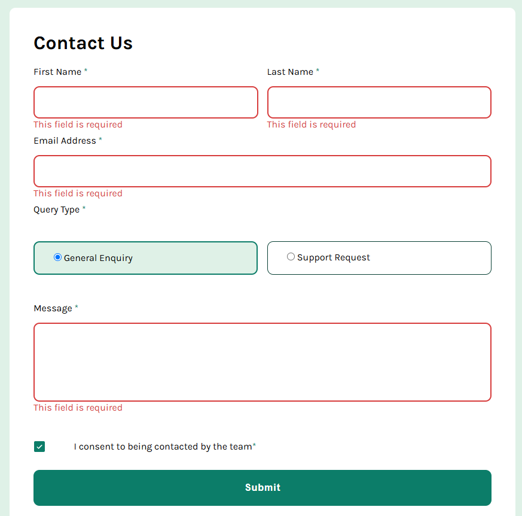
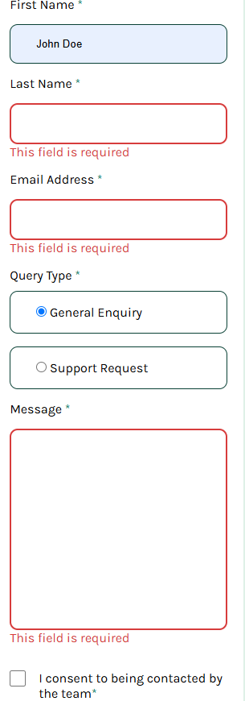

# Contact Form

A responsive contact form built with HTML, CSS, and JavaScript.

This project focuses on form validation, accessibility, responsive layouts, and user feedback. Users can submit their information through a clean interface while receiving real-time validation and success/error messages.

## 🚀 Live Demo

🔗 [View Live Site](https://kevsz34.github.io/Contact-Form/)

## 📸 Preview

## 🛠 Technologies

* HTML5
* CSS3
* JavaScript (Vanilla JS)
* Flexbox
* CSS Grid
* Responsive Design
* Accessibility (ARIA attributes)

## ✨ Features

* Responsive layout for mobile and desktop
* Form validation
* Email validation
* Required field validation
* Custom radio button selection
* Custom checkbox styling
* Success message after submission
* Keyboard navigation support
* Accessibility improvements using ARIA attributes

## 📚 What I Practiced

This project helped me improve:

* Form validation logic
* DOM manipulation
* Event handling
* Accessibility best practices
* Responsive layouts with Grid and Flexbox
* Error state management
* User feedback and form UX

## 🎯 Challenge

This project is part of the Frontend Mentor challenges.

Frontend Mentor provides realistic projects that help developers improve their front-end skills by building applications from professional designs.

## 👨‍💻 Author

* GitHub: https://github.com/kevsz34
* Frontend Mentor: https://www.frontendmentor.io/profile/kevsz34
